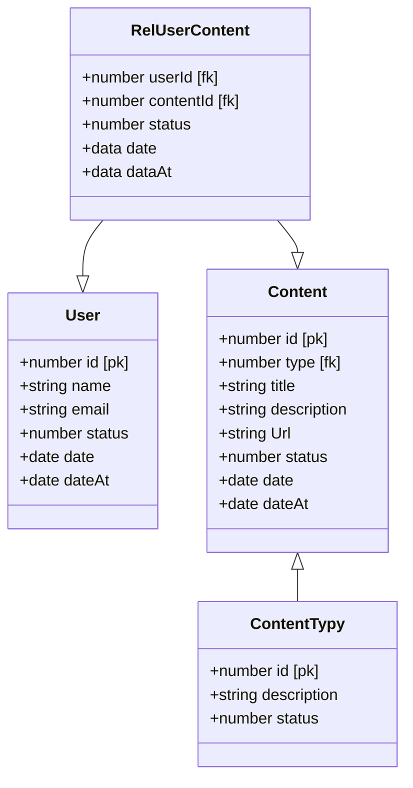

# Diagrama de Classes - GC


## Database

```sh
Banco de dados Mysql planetscale
https://app.planetscale.com/optedev/pipocaapi/connect
- "Server=aws.connect.psdb.cloud;Database=pipocaapi;user=;password=;SslMode=VerifyFull;"

- "Server=aws.connect.psdb.cloud;Database=pipocaapi;user=;password=;SslMode=VerifyFull;"

```
## CLI

```sh
- Comoda novo projeto 
dotnet new webapi --name  pipocaWebApi

add file readme.md
add file  .gitignore
git push


dotnet tool install --global dotnet-ef
dotnet tool update --global dotnet-ef

dotnet add package Microsoft.EntityFrameworkCore
dotnet add package Microsoft.EntityFrameworkCore.Design

dotnet add package MySql.EntityFrameworkCore

dotnet add package Pomelo.EntityFrameworkCore.MySql


```
## Migrations

```sh
dotnet ef migrations add Start --context DataContext
dotnet ef database update --context DataContext
cd


```


## Referencia
```sh

//https://jasonwatmore.com/post/2022/03/25/net-6-connect-to-mysql-database-with-entity-framework-core

```


## run
```sh
dotnet restoure
dotnet build
dotnet run

```