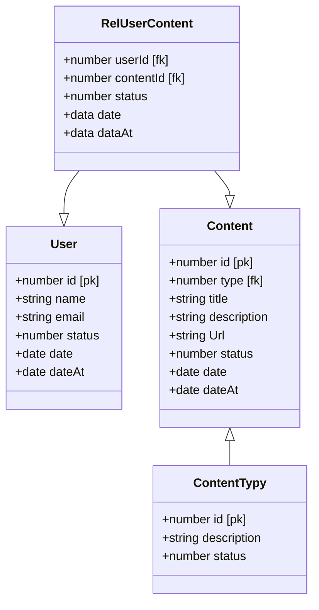

# Diagrama de Classes - GC


## Database

```sh
Banco de dados Mysql planetscale
https://app.planetscale.com/optedev/pipocaapi/connect
- "Server=aws.connect.psdb.cloud;Database=pipocaapi;user=;password=;SslMode=VerifyFull;"

- "Server=aws.connect.psdb.cloud;Database=pipocaapi;user=;password=;SslMode=VerifyFull;"

```
## CLI

```sh
- Comoda novo projeto 
dotnet new webapi --name  pipocaWebApi

add file readme.md
add file  .gitignore
git push


dotnet tool install --global dotnet-ef
dotnet tool update --global dotnet-ef

dotnet add package Microsoft.EntityFrameworkCore
dotnet add package Microsoft.EntityFrameworkCore.Design

dotnet add package MySql.EntityFrameworkCore

dotnet add package Pomelo.EntityFrameworkCore.MySql


(warn):dotnet add package  MySQL.EntityFrameworkCore.Extension

dotnet remove  package Microsoft.EntityFrameworkCore.Design
dotnet add package Microsoft.EnityFrameworkCore.Tools
dotnet add package Pomelo.EntityFrameworkCore.MySql 
dotnet add package Pomelo.EntityFrameworkCore.MySql.Design

dotnet ef dbcontext info


```
## Migrations

```sh
https://learn.microsoft.com/pt-br/ef/core/cli/dotnet#dotnet-ef-migrations-list
dotnet ef migrations add Start --context DataContext
dotnet ef database update --context DataContext
dotnet ef database instead. --context DataContext


dotnet ef migrations remove  --context DataContext

dotnet ef dbcontext info --context DataContext
dotnet ef dbcontext list --context DataContext
dotnet ef dbcontext script

select @@version;
8.0.23

DROP TABLE "__EFMigraçõesHistórico"
delete from __EFMigraçõesHistórico;

```


## Referencia
```sh

https://www.treinaweb.com.br/blog/entity-framework-core-com-mysql
//https://jasonwatmore.com/post/2022/03/25/net-6-connect-to-mysql-database-with-entity-framework-core

https://www.nuget.org/packages/Pomelo.EntityFrameworkCore.MySql/#readme-body-tab
https://jasonwatmore.com/net-7-dapper-mysql-crud-api-tutorial-in-aspnet-core


Não funcionou
https://dev.mysql.com/doc/connector-net/en/connector-net-entityframework-core.html

```


## run
```sh
dotnet restoure
dotnet build
dotnet run

```